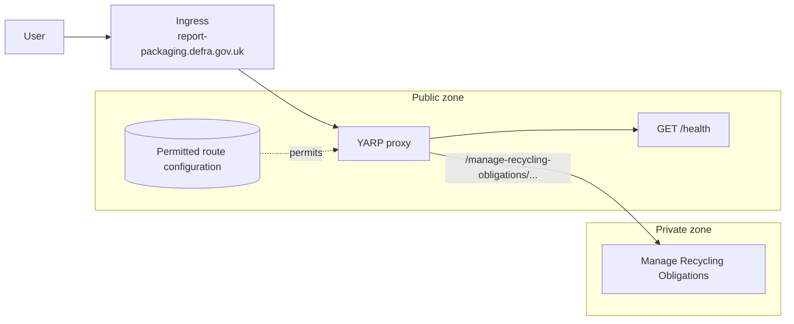

# Packaging waste proxy

A .NET 10 YARP reverse proxy prepared for the CDP build and deployment approach.

See the [architecture and follow-up review](docs/architecture-and-follow-up.md) for the evidence, recommendation, and next steps.

## Behaviour

- `GET /health` is handled by this service and returns `200 OK` with `{ "message": "success" }`.
- `GET /health/all` checks every configured downstream destination's `/health` endpoint. It returns `200 OK` only
  when they are all healthy, otherwise `503 Service Unavailable` with the per-destination result.
- The container listens on `PORT` (default `8085`) and includes `curl` for the CDP platform health check.

`/health/all` is protected by an exact, non-empty `X-Health-Check-Token` API-key header. The key defaults to empty
(which rejects every request), so deployments must configure it with the `Health__All__ApiKey` environment variable.
`Health__All__DownstreamTimeoutMilliseconds` optionally overrides the five-second downstream timeout.

## Shuttering a path

The proxy can temporarily replace a configured YARP route with a locally served GOV.UK holding page. Every request
that matches a shuttered route, including pages and assets below its public path, returns `503 Service Unavailable`,
`text/html`, and `Cache-Control: no-store`; the request is not sent to YARP or its downstream service. There is no
redirect. `/health` and `/health/all` cannot be shuttered, preserving the CDP health-check contract.

Shuttering is configured on the YARP route itself, so its `Match:Path` remains the single source of truth for the
public path. Set the route's `Metadata:Shuttered` value to `true` or `false`. The initial Manage Recycling Obligations
route is disabled by default:

```json
{
  "ReverseProxy": {
    "Routes": {
      "ManageRecyclingObligations": {
        "ClusterId": "ManageRecyclingObligations",
        "Match": {
          "Path": "/manage-recycling-obligations/{**catch-all}"
        },
        "Metadata": {
          "Shuttered": false
        }
      }
    }
  }
}
```

The holding-page body comes from an HTML fragment whose filename is derived from the route's `ClusterId`, converted
to kebab case. For example, `ManageRecyclingObligations` uses
[`manage-recycling-obligations.html`](src/ReverseProxy/Shuttering/Pages/manage-recycling-obligations.html), which is
inserted inside the shared GOV.UK page shell. `Example_Service` would use
`src/ReverseProxy/Shuttering/Pages/example-service.html`. A holding-page fragment is required only when its route is
shuttered; startup fails if it is missing. This means the route ID, cluster ID, and public path are not duplicated in
separate shuttering configuration.

The fragment controls the whole central body and can use GOV.UK Frontend classes, as in `cdp-app-shuttering`:

```html
<h1 class="govuk-heading-l">Sorry, the service is unavailable</h1>

<div class="govuk-body">
  <p>
    <a class="govuk-link" href="https://www.gov.uk/guidance/contact-defra">Contact the Defra Helpline</a> for
    further assistance.
  </p>
</div>
```

The existing route can be turned on with the deployment environment variable below; it remains off unless this is set
to `true`.

```text
ReverseProxy__Routes__ManageRecyclingObligations__Metadata__Shuttered=true
```

## Permitted-route design

The proxy is a permit list: a request may be sent only to a downstream service with an explicitly configured
public path. The first known mapping is **Manage Recycling Obligations**.



Ingress is responsible for mapping the public domain to this proxy deployment, so YARP does not currently match on
`Hosts`. This keeps public hostnames out of application configuration; only each environment's downstream address
varies. If a future deployment serves more than one public domain, add `Hosts` back to every permitted YARP route.

### Manage Recycling Obligations

The agreed public prefix is `/manage-recycling-obligations`. The YARP configuration is:

```json
{
  "ReverseProxy": {
    "Routes": {
      "ManageRecyclingObligations": {
        "ClusterId": "ManageRecyclingObligations",
        "Match": {
          "Path": "/manage-recycling-obligations/{**catch-all}"
        },
        "Metadata": {
          "Shuttered": false
        },
        "Transforms": [
          {
            "X-Forwarded": "Set",
            "Prefix": "Off"
          },
          {
            "PathRemovePrefix": "/manage-recycling-obligations"
          },
          {
            "RequestHeader": "X-Forwarded-Prefix",
            "Set": "/manage-recycling-obligations"
          }
        ]
      }
    },
    "Clusters": {
      "ManageRecyclingObligations": {
        "Destinations": {
          "Primary": {
            "Address": "https://unconfigured.invalid/"
          }
        }
      }
    }
  }
}
```

`https://unconfigured.invalid/` is a fail-closed placeholder. Startup validation prevents the proxy from running
until every destination has been overridden with the full base address of the relevant environment's Manage Recycling
Obligations service, including a trailing slash.

```text
ReverseProxy__Clusters__ManageRecyclingObligations__Destinations__Primary__Address=https://manage-recycling-obligations.production.internal/
Health__All__ApiKey=replace-with-a-secret-from-the-deployment-environment
```

For example, the transform forwards the request below without the public routing prefix:

```text
Public request:     POST /manage-recycling-obligations/returns?year=2026
Downstream request: POST https://manage-recycling-obligations.production.internal/returns?year=2026
                    X-Forwarded-Prefix: /manage-recycling-obligations
```

`X-Forwarded-Prefix` tells the downstream service which public prefix the proxy removed. YARP's default prefix
transform is disabled for this route because it takes its value from `PathBase`, which is empty here and would remove
the explicit header. The other standard `X-Forwarded-*` headers remain enabled. The downstream should trust forwarded
headers only when it can be reached through the proxy or another trusted private-network component.

The service assumes ingress is the only route to the proxy. Under that assumption, a client-supplied
`X-Forwarded-Host`, `X-Forwarded-Proto`, or `X-Forwarded-Prefix` is not passed through unchanged: YARP sets the host
and protocol headers from the request it receives, and this route sets the prefix to
`/manage-recycling-obligations`. Ingress must enforce the expected host name because YARP derives
`X-Forwarded-Host` from the incoming `Host` header.

No `Methods` constraint is configured, so the permitted path accepts every HTTP method, including `POST`. The
`{**catch-all}` path segment permits every suffix beneath `/manage-recycling-obligations`; use additional exact
routes with `Methods` restrictions if individual downstream operations need a narrower allow-list. Paths that do not
match a permitted route return `404` from the proxy without reaching a downstream service.

## Run locally

```sh
dotnet restore packaging-waste-proxy.slnx
dotnet run --project src/ReverseProxy
```

Then check the local endpoint:

```sh
curl http://localhost:8085/health
```

## Compose demonstration

```sh
docker compose up --build -d --wait
```

Compose starts the proxy and one WireMock downstream. The proxy's destination is overridden to `http://downstream:8080/`;
WireMock returns the expected canned response for `POST /returns?year=2026`. This demonstrates that the proxy removed
the public prefix before forwarding and supplied it in `X-Forwarded-Prefix`.

```sh
curl --fail --request POST 'http://localhost:8085/manage-recycling-obligations/returns?year=2026'
curl --include http://localhost:8085/not-permitted
```

The first command returns the WireMock response below. The second returns `404 Not Found`, even though WireMock has a
deliberate sentry response for `/not-permitted`; this proves the proxy did not forward the unpermitted path.

```json
{
  "method": "POST",
  "path": "/returns",
  "query": "?year=2026"
}
```

Stop the environment when finished:

```sh
docker compose down -v --remove-orphans
```

## Tests

Run the startup-validation unit tests without Docker:

```sh
dotnet test tests/ReverseProxy.Tests/ReverseProxy.Tests.csproj --no-restore
```

Start the Compose environment before running the routing integration tests:

```sh
dotnet test tests/ReverseProxy.IntegrationTests/ReverseProxy.IntegrationTests.csproj --no-restore
```

## Code quality

SonarCloud analysis runs after the validation, publish, and hot-fix jobs. It uses the repository `SONAR_TOKEN` secret
and reports coverage from both the unit and routing integration test projects to the
[Packaging Waste Proxy project](https://sonarcloud.io/project/overview?id=DEFRA_packaging-waste-proxy).
